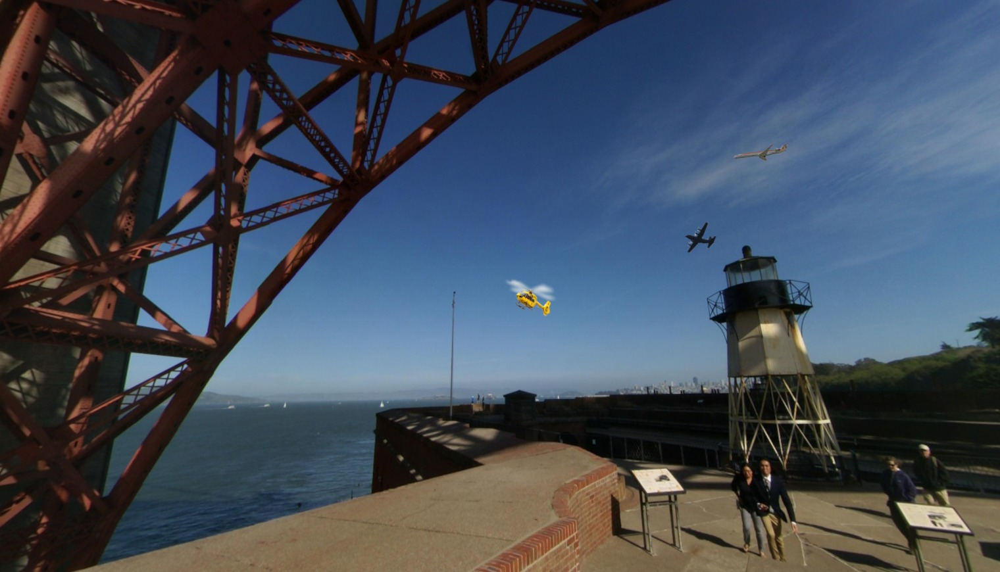

# VLM

## Input

1. Image containing several targets e.g.
   
2. A caption describing a specific target in the image. e.g.
   `"yellow helicopter"`

Note that images are provided as 1520x870 JPG files.

## Output

List of 4 integers corresponding to the bounding box of target identified by the caption within the image in left-top-width-height (LTWH) format.

Example: `[764, 420, 80, 60]`
